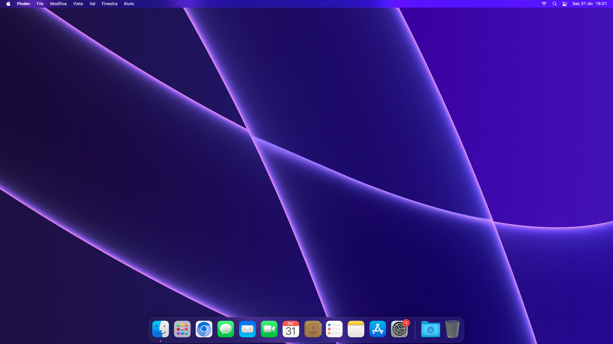

# openCoreAegis3
I managed to get macOS Monterey working on the MSI Aegis 3 prebuilt PC with NVIDIA GPU acceleration support. This repository will be updated in the future (or left in hands to the community) to make sure everything works fine on the most compatible macOS version.

## Installation
1. Copy and paste the EFI folder in your FAT32-formatted USB drive (or, if you have macOS, on the separated EFI partition of your USB drive)
2. Download the macOS recovery dmg and put it in the com.apple.recovery.boot directory of your USB drive.
3. Boot into the USB flash drive and proceed to install like normal
4. After the installation and setup of macOS, download and install OpenCore Legacy Patcher, then install the NVIDIA Web Driver patch

# Known issues
- Some apps may not work due to SIP being disabled
- The transparency has some rare bugs, nothing special with unofficial patches
